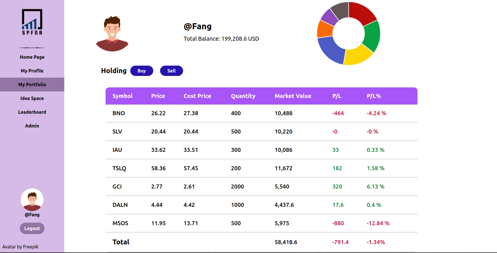
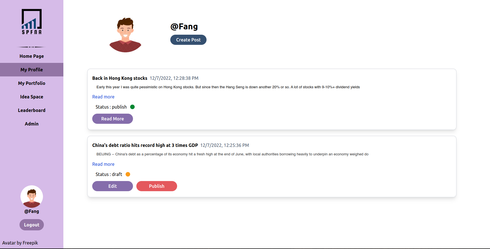

# SPFNA-stock-idea

SPFNA is a stock simulation investment game platform, which allows the user to simulate their stock portfolio and compete with friends who can make the most return on investment and will be the winner of the game. The SPFNA is created as a web-based platform. The rule of the game is that all users have to select the stock they think is going to outperform at the beginning of the year.

## SPFNA Features

- Stock simulation platform -> allows the user to design their own stock portfolio with the initial money starting at 200,000 USD. Login users can  select any 
stock around the world including the US, Europe, Hong Kong, Shanghai, Canada, Australia, Thailand, Russia, Japan, London
- Leader Board -> allows any user to view all top return portfolio contestants. Any user can see top contestants holding.
- Portfolio P&L Distribution -> allows any user to view the portfolio profit and loss Distribution of contestants.
- IDEA sharing -> This feature allows login users to post their stock ideas to the public and Other login users can comment and share  Ideas.
- Admin Announcement -> This feature allows Admin users to announce activity related to the competition.

## Dev Tools 🖥️ 
### Front-end
&nbsp;
&nbsp;
&nbsp;
&nbsp;
### Back-end: 
&nbsp;
&nbsp;
&nbsp;
&nbsp;

## List feature 

### Authenication
- [x] Register (QA)
- [x] Login (QA)
- [ ] Logout
### portfolio
- [x] display portfolio
- [x] buy stock portfolio
- [x] sell stock portfolio
- [x] display leaderboard
### leaderboard and P&L
- [x] LeaderBoard
- [ ] P&L

### Convert currency
- [ ] display cash report
- [ ] convert currency from one currency to other currency

### idea space
- [x] display all idea
- [x] write idea
- [x] save draft idea
- [x] load draft idea
- [x] publish idea
- [x] comment on idea

### Announcement
- [x] Admin write annoucement
- [x] display all annoucement
- [x] save draft annoucement 
- [x] load draft announcement
- [x] publish announcement

## Page

### portfolio page

### profile page

